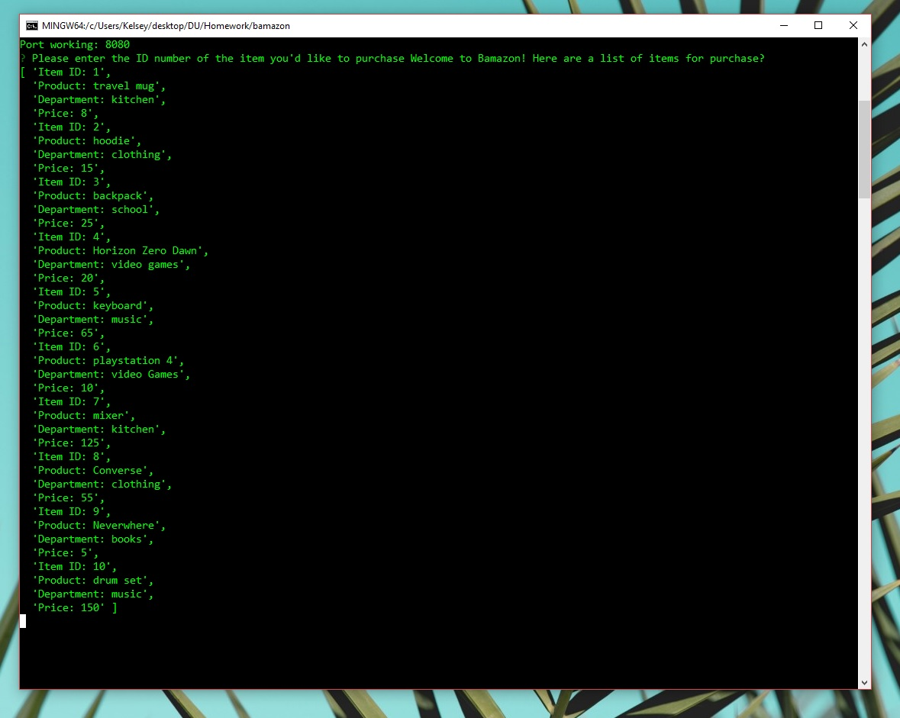
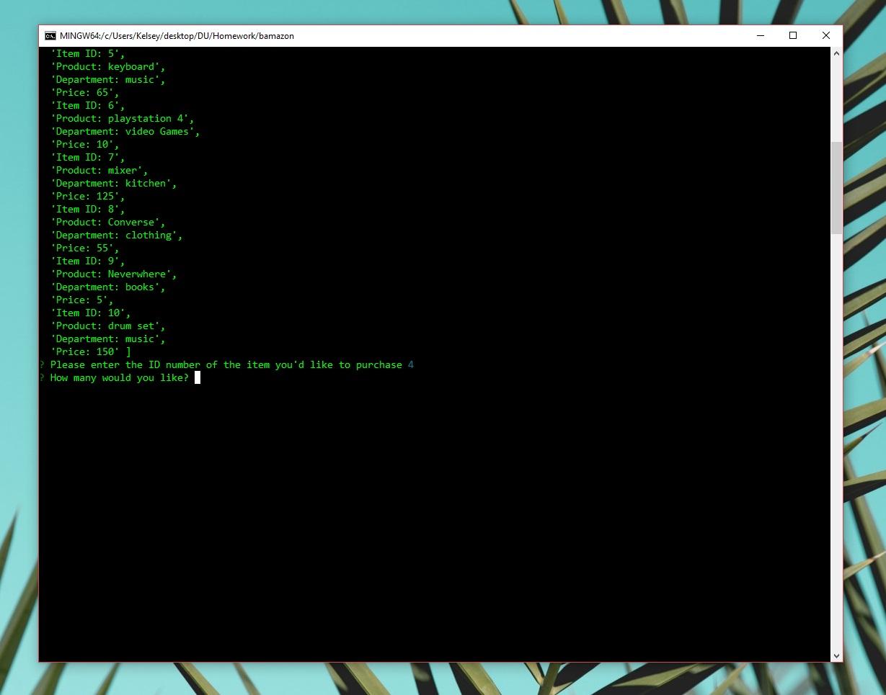
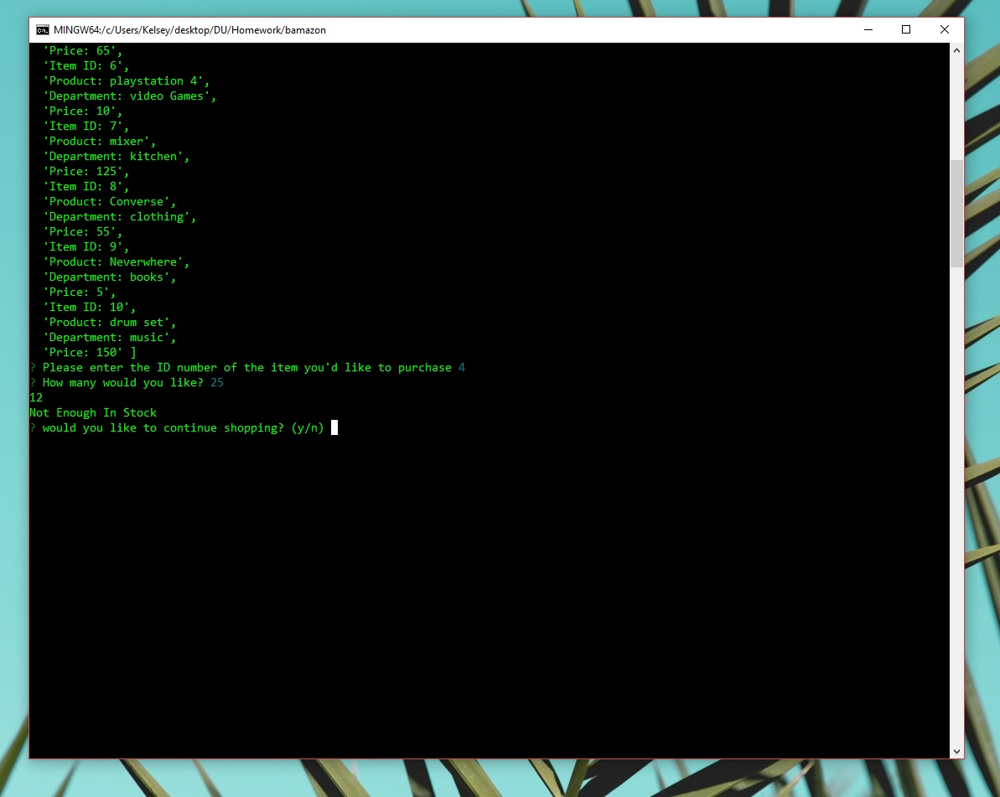
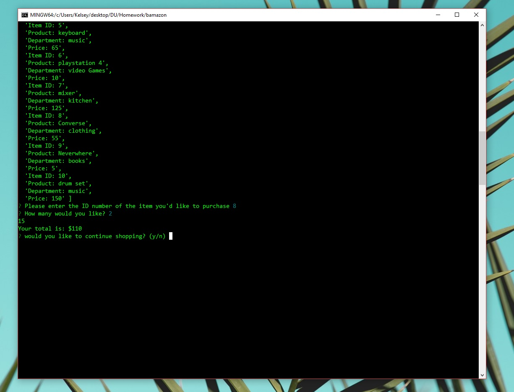

Overview:

Bamazon is a store-like application that uses MySQL database. The app takes in orders from the customer and updates the database stock. 

Example:

Start up screen shows list of items avaiable 

Asking for the id of the item the customer wishes to purchase

Prompting the user if there is not enough items in stock

Once the customer has chosen an item and there is enough in stock then the prompt can diplay the cost and will update the database

Stack Used:

* Node Packages & MySQL